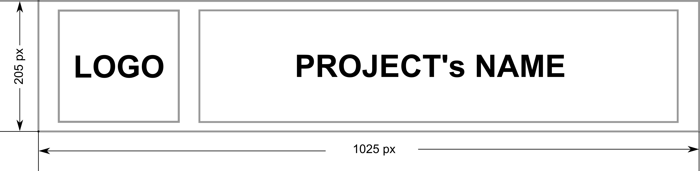

# OntoGraph Package

[](https://github.com/saezlab/ontograph/actions/workflows/ci-testing-unit.yml)
[](https://saezlab.github.io/ontograph/)


## Description

A lightweight Python package for loading, representing, and efficiently querying biological ontologies as graph structures.

## Installation

This package is under development, by this time you can clone the repository and install the package in "editable" (`-e` or `--editable`) mode

```bash
git clone https://github.com/saezlab/ontograph.git
uv pip install -e .
```

## Usage

### Interacting locally with the OBO Foundry catalog

```python
from ontograph.client import ClientCatalog

# Instantiate a client for your catalog
client_catalog = ClientCatalog(cache_dir="./data/out")

# Load the catalog, in case this one doesn't exist it will be downloaded automatically in the cache folder you specify.
client_catalog.load_catalog()
```

#### Retrieve the list of ontologies (name_id and description) in OBO Foundries 
```bash
ontologies_list = client_catalog.list_available_ontologies()
```

#### Print the list in a suitable format
```bash
client_catalog.print_available_ontologies()
```
#### Obtain metadata about an specific ontology
```bash
metadata_go = client_catalog.get_ontology_metadata(ontology_id="go", show_metadata=True) # Print in terminal
```

### Interacting with an ontology
#### Create a client for your ontology
```python
from ontograph.client import ClientOntology

# Instantiate a client for your ontology
client_dummy_ontology = ClientOntology(cache_dir="./data/out")

# Load a dummy ontology, we prepare a simple one to try out this package.
client_dummy_ontology.load(file_path_ontology="./tests/resources/dummy_ontology.obo")
```
#### Queries for your ontology
##### Navigation
- `client_dummy_ontology.get_ancestors(term_id="S")`
- `list(client_dummy_ontology.get_ancestors_with_distance(term_id="S"))`
- `client_dummy_ontology.get_children(term_id="A")`
- `client_dummy_ontology.get_descendants(term_id="U")`
- `list(client_dummy_ontology.get_descendants_with_distance(term_id="U"))`
- `client_dummy_ontology.get_parents(term_id="U")`
- `client_dummy_ontology.get_root()`
- `client_dummy_ontology.get_siblings(term_id="K1")`
- `client_dummy_ontology.get_term(term_id="E")`

##### Relations
- `client_dummy_ontology.get_common_ancestors(node_ids=["K", "L"])`
- `client_dummy_ontology.get_lowest_common_ancestors(node_ids=["K", "L"])`
- `client_dummy_ontology.is_ancestor(ancestor_node="A", descendant_node="N")`
- `client_dummy_ontology.is_descendant(descendant_node="A", ancestor_node="N")`
- `client_dummy_ontology.is_sibling(nodeA="F", nodeB="G")`

##### Introspection
- `client_dummy_ontology.get_distance_from_root(term_id="V")`
- `client_dummy_ontology.get_path_between(nodeA="Q", nodeB="B")`
- `trajectories = client_dummy_ontology.get_trajectories_from_root(term_id="Y")`
- `client_dummy_ontology.print_term_trajectories_tree(trajectories)`

## Contributing

Pull requests are welcome. For major changes, please open an issue first
to discuss what you would like to change.

Please make sure to update tests as appropriate.

- [ ] TODO: add contribution guidelines. All of them can be modified in the mkdocs documentation (./docs/community)

## License

[MIT](https://choosealicense.com/licenses/mit/)

- [ ] TODO: Modify this based on the license you choose.
- [ ] TODO: Modify the LICENSE file based on the license you choose.
