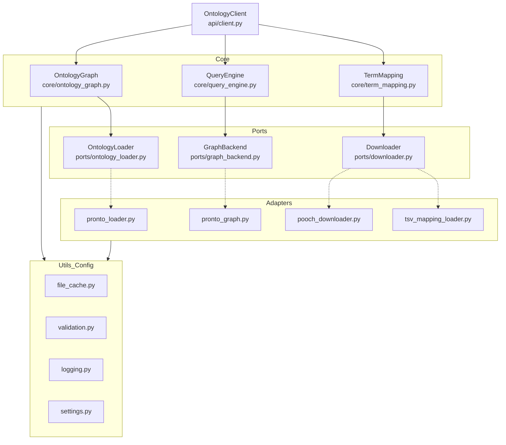

# API final view from user perspective

## Importing the library
- Complete import of Ontograph
```python
import ontograph
```   


## Download Ontologies
- Download a single ontology from standard resources
```python
resource = [
    {"name_id": "go", "format": "obo"},
]

path_ontologie = ontograph.downloader.download(resource, cache_directory)
```   

- Download a multiple ontologies from standard resources
```python
resources = [
    {"name_id": "go", "format": "obo"},
    {"name_id": "chebi", "format": "owl"},
]

paths_ontologies = ontograph.downloader.download(resources, cache_directory)
```

## Load ontologies

- Load the "ontology from standard resources, or local source"
```python
gene_ontology = ontograph.load(name_id="go", format="obo")
```

## Exploring the ontology

- Print the metadata related to the ontology
```python
gene_ontology.metadata()
```

- Print the roots of the ontology
```python
gene_ontology.roots()
```




**Legend:**

- --> means "uses"
- -.-> means "implemented by"
