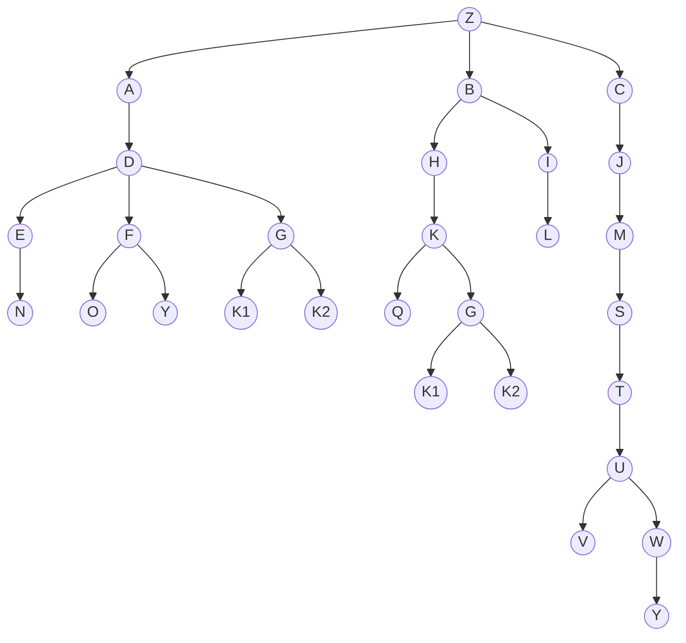

# Quickstart

Welcome to the OntoGraph Quickstart!  
This guide will help you get up and running with OntoGraph, showing you how to explore ontology catalogs and interact with ontologies programmatically.

---

## 1. Explore the OBO Foundry Catalog

First, let's interact with the OBO Foundry catalog to discover available ontologies.

```python
from ontograph.client import ClientCatalog

# Create a catalog client (specify a cache directory for downloads)
client_catalog = ClientCatalog(cache_dir="./data/out")

# Load the catalog (downloads if not cached)
client_catalog.load_catalog()
```

### List Available Ontologies

```python
# Get a list of ontologies (as dicts with id and title)
ontologies_list = client_catalog.list_available_ontologies()
print(ontologies_list[:3])  # Show the first three
```

### Print Ontology List

```python
client_catalog.print_available_ontologies()
```

### Get Metadata for a Specific Ontology

```python
# Show metadata for the Gene Ontology (GO)
metadata_go = client_catalog.get_ontology_metadata(ontology_id="go", show_metadata=True)
```

---

## 2. Load and Explore an Ontology

Now, let's load an ontology and explore its structure.

```python
from ontograph.client import ClientOntology

# Create an ontology client
client_ontology = ClientOntology(cache_dir="./data/out")

# Load a sample ontology (provided in the repo for testing)
client_ontology.load(file_path_ontology="./tests/resources/dummy_ontology.obo")
```

---

## 3. Visualize the Ontology Structure

The included demo ontology has the following structure (Z is the root):



---

## 4. Common Ontology Queries

### Navigation

- **Get ancestors:**  
  ```python
  client_ontology.get_ancestors(term_id="S")
  ```
- **Ancestors with distance:**  
  ```python
  list(client_ontology.get_ancestors_with_distance(term_id="S"))
  ```
- **Get children:**  
  ```python
  client_ontology.get_children(term_id="A")
  ```
- **Get descendants:**  
  ```python
  client_ontology.get_descendants(term_id="U")
  ```
- **Descendants with distance:**  
  ```python
  list(client_ontology.get_descendants_with_distance(term_id="U"))
  ```
- **Get parents:**  
  ```python
  client_ontology.get_parents(term_id="U")
  ```
- **Get root node:**  
  ```python
  client_ontology.get_root()
  ```
- **Get siblings:**  
  ```python
  client_ontology.get_siblings(term_id="K1")
  ```
- **Get a term:**  
  ```python
  client_ontology.get_term(term_id="E")
  ```

### Relations

- **Common ancestors:**  
  ```python
  client_ontology.get_common_ancestors(node_ids=["K", "L"])
  ```
- **Lowest common ancestors:**  
  ```python
  client_ontology.get_lowest_common_ancestors(node_ids=["K", "L"])
  ```
- **Is ancestor:**  
  ```python
  client_ontology.is_ancestor(ancestor_node="A", descendant_node="N")
  ```
- **Is descendant:**  
  ```python
  client_ontology.is_descendant(descendant_node="A", ancestor_node="N")
  ```
- **Is sibling:**  
  ```python
  client_ontology.is_sibling(nodeA="F", nodeB="G")
  ```

### Introspection

- **Distance from root:**  
  ```python
  client_ontology.get_distance_from_root(term_id="V")
  ```
- **Path between nodes:**  
  ```python
  client_ontology.get_path_between(nodeA="Q", nodeB="B")
  ```
- **All trajectories from root:**  
  ```python
  trajectories = client_ontology.get_trajectories_from_root(term_id="Y")
  ```
- **Print trajectories tree:**  
  ```python
  client_ontology.print_term_trajectories_tree(trajectories)
  ```

---

## Next Steps

- Explore the [API Reference](../../reference/source/ontograph/client-ontology.md) for more details.
- Try loading your own ontology files or experiment with different queries!

> _OntoGraph makes ontology exploration and analysis simple and powerful.
