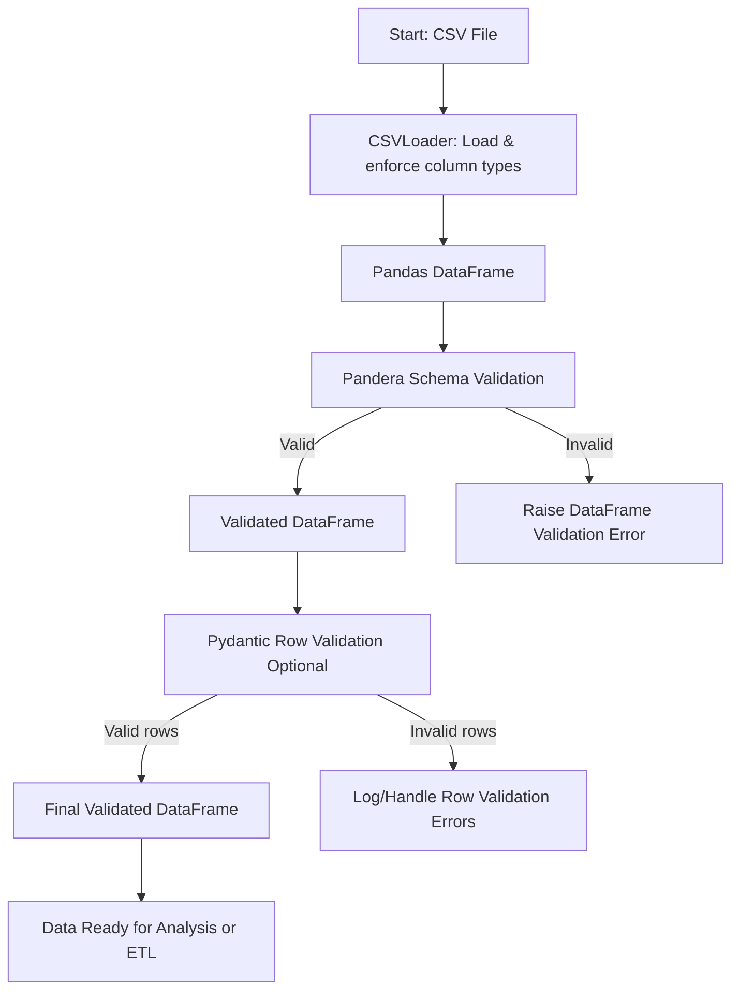

```mermaid
flowchart TD
    A[Start: CSV File] --> B[CSVLoader: Load & enforce column types]
    B --> C[Pandas DataFrame]
    C --> D[Pandera Schema Validation]
    D -->|Valid| E[Validated DataFrame]
    D -->|Invalid| F[Raise DataFrame Validation Error]
    E --> G[Pydantic Row Validation Optional]
    G -->|Valid rows| H[Final Validated DataFrame]
    G -->|Invalid rows| I[Log/Handle Row Validation Errors]
    H --> J[Data Ready for Analysis or ETL]
```
